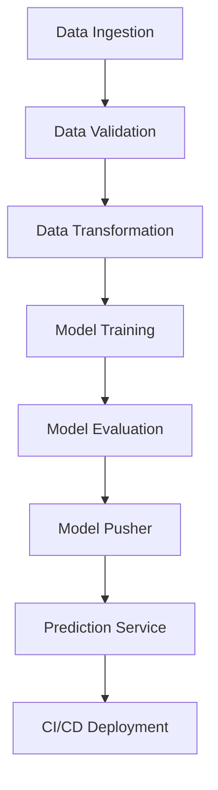

# 🚗 Vehicle Data MLOps Pipeline - End-to-End Machine Learning Workflow with CI/CD

[](https://github.com/Jittub45/MLOps-Project-1/actions/workflows/aws.yaml)
[](https://www.python.org/downloads/release/python-310/)
[](LICENSE)
[](https://github.com/Jittub45/MLOps-Project-1/issues)

An end-to-end MLOps pipeline implementing automated machine learning workflows with MongoDB integration, AWS cloud services, Docker containerization, and CI/CD deployment.

## 📌 Features

- **Complete MLOps Lifecycle**: Data ingestion to model deployment
- **Cloud Integration**: MongoDB Atlas & AWS S3/EC2/ECR
- **CI/CD Pipeline**: Automated testing & deployment with GitHub Actions
- **Production-Ready**: Docker containerization & Flask web API
- **ML Workflow Management**: Experiment tracking & model versioning
- **Infrastructure as Code**: Configuration management with YAML

##  Installation

```bash
# Clone repository
git clone https://github.com/Jittub45/MLOps-Project-1.git
cd MLOps-Project-1

# Create conda environment
conda create -n vehicle python=3.10 -y
conda activate vehicle

# Install dependencies
pip install -r requirements.txt

# Set environment variables
export MONGODB_URL="your_connection_string"
export AWS_ACCESS_KEY_ID="your_aws_key"
export AWS_SECRET_ACCESS_KEY="your_aws_secret"
```

## 🗂 Project Structure

```
├── .github/workflows          # CI/CD configurations
├── config/                    # Configuration files
├── notebooks/                 # EDA & experimental notebooks
├── src/                       # Core source code
│   ├── components/            # Pipeline components
│   ├── entity/                # Configuration entities
│   ├── pipeline/              # Training pipelines
│   └── aws_storage/           # AWS S3 integration
├── static/                    # Web app static files
├── templates/                 # Web app templates
├── tests/                     # Unit tests
└── vehicle/                   # Local package
```

## 🔧 Workflow Architecture



## 🛠 Implementation Details

###  Data Ingestion
- MongoDB Atlas integration for data storage
- Automated dataset fetching and preprocessing
- Environment variable management for credentials

###  Data Validation
- Schema validation using YAML configurations
- Statistical threshold checks
- Data quality monitoring

###  Data Transformation
- Custom preprocessing pipelines
- Feature engineering workflows
- Column transformer implementation

###  Model Training
- Experiment tracking with MLflow
- Hyperparameter configuration management
- Model version control

###  Model Evaluation
- AWS S3 integration for model storage
- Performance threshold monitoring
- Model comparison and selection

###  Model Deployment
- Docker containerization
- Flask REST API endpoints
- AWS EC2 instance deployment

###  CI/CD Pipeline
- GitHub Actions workflow automation
- AWS ECR container registry
- Self-hosted runners on EC2
- Automated testing and deployment

## 🌐 Usage

```bash
# Start Flask application
python app.py

# Access web interface
http://<ec2-public-ip>:5080

# Trigger training via API
curl http://localhost:5080/training

# Make predictions
curl -X POST -H "Content-Type: application/json" -d '{"input_data": [...]}' http://localhost:5080/predict
```

## 📈 CI/CD Implementation

1. Dockerized application with multi-stage build
2. GitHub Actions workflow for:
   - Automated testing
   - Docker image building
   - ECR push/pull operations
3. AWS infrastructure:
   - ECR repository for Docker images
   - EC2 instance with Docker runtime
   - S3 bucket for model storage
4. Security:
   - IAM role management
   - Environment variable encryption
   - Network security groups

## 🤝 Contributing

Contributions welcome! Please follow:
1. Fork the repository
2. Create your feature branch
3. Commit changes
4. Push to the branch
5. Open a Pull Request

## 📄 License

This project is licensed under the MIT License - see [LICENSE](LICENSE) file for details.

##  Contact

Jittub45 - [LinkedIn](https://www.linkedin.com/in/kumarjitendra1/) - jitendrakumaryadav2003@.com

Project Link: [https://github.com/Jittub45/MLOps-Project-1](https://github.com/Jittub45/MLOps-Project-1)
```

